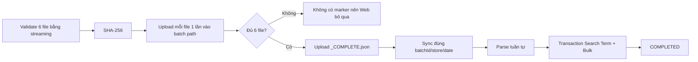

# HƯỚNG DẪN SETUP HỆ THỐNG MAC CRAWLER & ĐỒNG BỘ R2 (AMAZON PPC)

Thư mục này được thiết kế **hoàn toàn độc lập (standalone)**, tối ưu cho máy **Mac mini M1** cắm chạy tự động 24/7:
1. **Nhận lệnh từ xa (Remote Worker):** Lắng nghe lệnh trực tiếp từ Web App (`https://ncehub.net`), hỗ trợ theo dõi tiến độ 6 file thời gian thực, cơ chế Lease Token chống trùng lặp, và Checkpoint khôi phục nguyên tử khi đứt đoạn.
2. **Lịch cố định:** Đúng **12:00 trưa mỗi ngày**, scheduler xếp một job riêng cho mỗi store; remote worker xử lý tuần tự, tránh tranh lock và một store lỗi không chặn kết quả của store khác.
3. **Tải đủ 6 báo cáo PPC Amazon:**
   - `Bulk SP 30d` & `Bulk SP 7d`
   - `Bulk SB 30d` & `Bulk SB 7d`
   - `Search Term SP 30d` & `Search Term SB 30d`
4. **Phân loại & Lưu trữ cục bộ:** Lưu tại `~/AmazonPpcCrawler/downloads/{YYYY-MM-DD}/{STORE_NAME}/`, chia thành `SP/` và `SB/`. Không dùng Desktop/Downloads vì LaunchAgent bị macOS TCC chặn.
5. **Upload Cloudflare R2:** Mỗi file chỉ upload một lần vào batch riêng; kiểm tra SHA-256 và tạo marker `_COMPLETE.json` cuối cùng.
6. **Đồng bộ Database:** Chỉ gửi đúng `batchId/store/date` vừa hoàn tất, không quét toàn bộ lịch sử R2. Search Term và Bulk được commit trong cùng transaction.

---

> [!IMPORTANT]
> **VỊ TRÍ ĐẶT THƯ MỤC TRÊN MAC MINI:**
> macOS sandbox chặn các dịch vụ chạy nền của `launchd` truy cập thư mục Desktop (`Operation not permitted`).
> **Luôn luôn đặt thư mục tại thư mục Home người dùng: `~/mac-crawler`** (tức `/Users/ad/mac-crawler`), **KHÔNG** đặt trong `~/Desktop`.

---

## 📋 TỔNG HỢP CÁC LỆNH TERMINAL TRÊN MAC MINI

Dưới đây là danh sách đầy đủ toàn bộ các lệnh bạn cần dùng trong quá trình cài đặt, vận hành và xử lý lỗi:

### 1. Cài đặt & Chuẩn bị ban đầu (Setup)

```bash
# Di chuyển vào thư mục crawler
cd ~/mac-crawler

# Cài đặt môi trường tự động (Kiểm tra Node, Python, boto3, cấp quyền)
./setup_mac.sh
```

---

### 2. Quản lý Dịch vụ Remote Worker (Nhận lệnh từ Web)

Worker chạy nền với mức ưu tiên CPU/I/O thấp, tự động bật cùng macOS để nhận lệnh khi bạn bấm trên Web App. Khi không có job, worker chỉ polling theo chu kỳ cấu hình:

```bash
cd ~/mac-crawler

# Cài đặt và BẬT dịch vụ Worker chạy ngầm:
./install_worker_service.sh

# DỪNG và GỠ BỎ dịch vụ Worker:
./uninstall_worker_service.sh

# Kiểm tra xem Worker có đang chạy không (nếu có trả về PID là đang chạy):
launchctl list | grep com.amazon.ppc.worker

# Khởi động lại Worker (khi bạn vừa sửa file config.env hoặc code):
launchctl bootout "gui/$(id -u)/com.amazon.ppc.worker" 2>/dev/null || launchctl unload ~/Library/LaunchAgents/com.amazon.ppc.worker.plist 2>/dev/null
launchctl load -w ~/Library/LaunchAgents/com.amazon.ppc.worker.plist
```

---

### 3. Xem Log Hoạt Động (Logs)

```bash
# 1. Xem LOG TRỰC TIẾP theo thời gian thực (Live Stream - Bấm Ctrl + C để thoát):
tail -f ~/Library/Logs/mac-crawler-worker.log

# 2. Xem 50 dòng log gần nhất:
tail -n 50 ~/Library/Logs/mac-crawler-worker.log

# 3. Xem 100 dòng log gần nhất:
tail -n 100 ~/Library/Logs/mac-crawler-worker.log

# 4. Xóa sạch file log cũ (nếu log bị đầy hoặc muốn dọn dẹp):
> ~/Library/Logs/mac-crawler-worker.log

# 5. Xem log của Lịch chạy 12h trưa tự động (nếu có bật):
tail -f ~/Library/Logs/mac-crawler.log
```

Log được tự xoay khi đạt `MAX_LOG_MB` và xóa theo `LOG_RETENTION_DAYS`; không cần xóa thủ công định kỳ.

---

## Tối ưu tài nguyên và retention

Các giá trị mặc định nằm trong `config.env.example`:

- `WORKER_POLL_SECONDS=10`: giảm request nền nhưng vẫn nhận job nhanh.
- `MIN_FREE_DISK_GB=10`: từ chối chạy trước khi ổ đĩa quá đầy.
- `LOCAL_RETENTION_DAYS=14`: dọn thư mục tải cũ theo ngày.
- `CHECKPOINT_RETENTION_DAYS=30`: dọn checkpoint cũ.
- `MAX_LOG_MB=20`, `LOG_RETENTION_DAYS=14`: giới hạn log.
- `WORKER_ID`: nên đặt cố định cho từng Mac mini.

`maintenance.sh` chạy trước worker và lịch daily. Script chỉ dọn bên trong thư mục download/checkpoint đã resolve cụ thể.

Luồng publish tối ưu:



Sau khi tạo marker, Mac bàn giao nguyên tử `crawler job + lease + batch + store + 6 task` cho server rồi chuyển sang store kế tiếp ngay. Ingestion worker trên server chạy tuần tự (`concurrency = 1`) và tự chuyển crawler job từ `INGESTING` sang `COMPLETED` hoặc `FAILED`; Mac không giữ AdsPower để chờ database.

---

### 4. Quản lý Lịch Chạy Tự Động (Daily LaunchAgent)

LaunchAgent chạy `schedule_daily_job.sh` để xếp một job cho từng store đang bật trong `stores.json`. Server cho phép nhiều store chờ trong hàng đợi nhưng Mac mini chỉ chạy một store tại một thời điểm. Khóa `daily:<ngày>:<store>` ngăn scheduler tạo trùng nếu chạy lại trong cùng ngày.

```bash
cd ~/mac-crawler

# 1. Cài đặt lịch mặc định (12:00 TRƯA MỖI NGÀY):
./install_launchd.sh

# 2. Cài đặt lịch theo GIỜ BẤT KỲ (ví dụ 13:45 hoặc 14:05):
./install_launchd.sh 13:45

# 3. Cài đặt lịch test ép buộc chạy (bỏ qua kiểm tra trùng lặp trong ngày):
./install_launchd.sh 13:45 --force

# 4. Kiểm tra xem lịch đã đăng ký vào macOS launchd chưa:
launchctl list | grep com.amazon.ppc.crawler

# 5. Xem log tiến trình đặt lịch:
tail -f ~/Library/Logs/mac-crawler.log

# 6. Gỡ bỏ lịch tự động:
./uninstall_launchd.sh
```

---

### 5. Chạy Thử Lệnh Lập Lịch Ngay Lập Tức (Test Scheduler)

Nếu muốn test ngay lập tức việc xếp job vào hàng đợi Web App mà không cần chờ đến giờ hẹn:

```bash
cd ~/mac-crawler

# Test xếp job bình thường:
./schedule_daily_job.sh

# FORCE TEST: Ép buộc tạo job mới ngay cả khi hôm nay đã crawl rồi:
./schedule_daily_job.sh --force
```

---

### 6. Chạy Thử Trực Tiếp Bằng Tay (Test Run Standalone)

Nếu muốn test trực tiếp Playwright -> AdsPower mà không qua Web:

```bash
cd ~/mac-crawler

# Chạy test toàn bộ quy trình: Bật AdsPower -> Tải 6 file -> Up R2 -> Báo Web
./test_run.sh
```

---

### Auto Upload Bulk từ server

File mẫu trắng Amazon **không đặt trên Mac mini**. Nó phải được deploy cùng web server tại:

`templates/ppc/AdvertisingBulksheetTemplate-seller.xlsx`

Server dùng template này để tạo file update, lưu file lên R2 và tạo remote job. Mac mini tự tải từng file vào:

`~/AmazonPpcCrawler/bulk-upload/inbox/<job-id>/`

Sau khi bấm Upload, worker tiếp tục đọc đúng dòng lịch sử theo tên file và chỉ báo `SUCCESS` khi Amazon xử lý hoàn tất không lỗi. Kết quả có lỗi một phần là `PARTIAL_SUCCESS`; nếu quá thời gian chờ là `RESULT_TIMEOUT`. Hai trường hợp này không đánh dấu action là `APPLIED`.

Mặc định worker kiểm tra mỗi 15 giây, tối đa 15 phút. Có thể chỉnh trong `config.env` bằng `BULK_RESULT_POLL_MS` và `BULK_RESULT_TIMEOUT_MS`. Trong lúc kiểm tra worker vẫn gửi heartbeat, giữ đúng profile/store và không chạy song song profile khác để tránh nhầm file trên Mac 8GB.

File thành công được chuyển sang `completed/<job-id>/`; file lỗi, lỗi một phần hoặc chưa xác định được kết quả được chuyển sang `failed/<job-id>/`. Có thể đổi thư mục gốc bằng `BULK_UPLOAD_DIR` trong `config.env`. Không chép file thủ công vào `inbox` vì file không có job, R2 key và SHA-256 sẽ không được xử lý.

### 6. Xử Lý Sự Cố Thường Gặp (Troubleshooting)

#### Lỗi: `Operation not permitted`
- **Nguyên nhân:** Thư mục `mac-crawler` đang nằm trong `Desktop` hoặc `Downloads`, bị macOS TCC chặn quyền chạy ngầm.
- **Cách khắc phục:**
  ```bash
  # 1. Dừng service cũ
  launchctl bootout "gui/$(id -u)/com.amazon.ppc.worker" 2>/dev/null || true
  
  # 2. Chuyển thư mục ra ngoài Home
  mv ~/Desktop/mac-crawler ~/mac-crawler
  
  # 3. Cài lại service tại vị trí mới
  cd ~/mac-crawler
  ./install_worker_service.sh
  ```

#### Lỗi: `Không thể kết nối AdsPower API`
- **Nguyên nhân:** Ứng dụng AdsPower chưa mở hoặc chưa bật Local API.
- **Cách khắc phục:**
  1. Mở app **AdsPower**.
  2. Vào **Settings** $\to$ **Local API** $\to$ Bật công tắc on (port mặc định `50325`).

#### Lỗi: `Không tìm thấy checkpoint hoặc muốn crawl lại từ đầu`
- Các file checkpoint được lưu tại:
  `~/Library/Application Support/AmazonPpcCrawler/jobs/`
- Nếu muốn xóa toàn bộ checkpoint cũ để crawl lại mới tinh:
  ```bash
  rm -rf ~/Library/Application\ Support/AmazonPpcCrawler/jobs/*
  ```

---

## 📦 LỆNH ĐÓNG GÓI TRÊN MÁY CHÍNH ĐỂ GỬI SANG MAC MINI

Khi bạn chỉnh sửa code trên máy MacBook làm việc và muốn đóng gói gửi sang Mac mini:

```bash
cd "/Users/macbook/Desktop/Amazon Listing Management"

# Đóng gói zip nhẹ (~65KB, tự loại bỏ node_modules và file rác):
zip -r ~/Desktop/mac-crawler.zip mac-crawler \
  -x "mac-crawler/node_modules/*" \
  -x "mac-crawler/__pycache__/*" \
  -x "mac-crawler/.*"
```

Sau khi copy file `mac-crawler.zip` sang Mac mini, mở Terminal Mac mini giải nén vào thư mục Home:
```bash
unzip ~/Downloads/mac-crawler.zip -d ~/
cd ~/mac-crawler
./setup_mac.sh
./install_worker_service.sh
```
