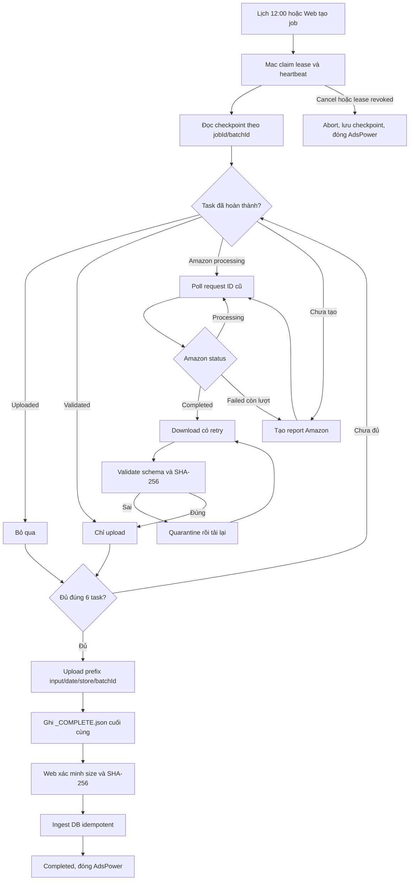

# HƯỚNG DẪN SETUP HỆ THỐNG MAC CRAWLER & ĐỒNG BỘ R2 (AMAZON PPC)

Thư mục này được thiết kế **hoàn toàn độc lập (standalone)**, tối ưu cho máy **Mac mini M1** cắm chạy tự động 24/7. Đúng **12:00 trưa mỗi ngày**, hệ thống tự động:
1. Kết nối với trình duyệt **AdsPower** qua CDP / Local API (tự động bật profile nếu chưa mở).
2. Tải đủ **6 báo cáo PPC**:
   - `Bulk SP 30d` & `Bulk SP 7d`
   - `Bulk SB 30d` & `Bulk SB 7d`
   - `Search Term SP 30d` & `Search Term SB 30d`
3. Phân loại và lưu trữ ngăn nắp trên máy Mac theo đúng cấu trúc bạn đã thiết lập:
   ```text
   ~/Downloads/Bulk file/
   └── YYYY-MM-DD/
       └── HSOSTORE/
           ├── SP/
           │   ├── HSOSTORE_Bulk_SP_30Days_...xlsx
           │   ├── HSOSTORE_Bulk_SP_7Days_...xlsx
           │   └── HSOSTORE_Search_Term_SP_30Days_...xlsx
           ├── SB/
           │   ├── HSOSTORE_Bulk_SB_30Days_...xlsx
           │   ├── HSOSTORE_Bulk_SB_7Days_...xlsx
           │   └── HSOSTORE_Search_Term_SB_30Days_...xlsx
           └── manifest.json
   ```
4. Kiểm tra đúng 6 loại file, kiểm tra sheet/header, rồi đẩy toàn bộ lên **Cloudflare R2** theo Key chuẩn hóa:
   - `ppc-reports/input/{YYYYMMDD}/{STORE_NAME}/{BATCH_ID}/SP/...`
   - `ppc-reports/input/{YYYYMMDD}/{STORE_NAME}/{BATCH_ID}/SB/...`
   - `ppc-reports/input/{YYYYMMDD}/{STORE_NAME}/{BATCH_ID}/_COMPLETE.json` được ghi cuối cùng; server bỏ qua batch thiếu marker hoặc sai checksum.
5. Kích hoạt Web App (`POST /api/ppc/sync-r2`) để hệ thống tự động kéo từ R2 về và nạp vào cơ sở dữ liệu PostgreSQL.
6. Hiển thị thông báo màn hình macOS (Notification) và ghi log chi tiết.

## Luồng retry, checkpoint và publish nguyên tử



- File checkpoint: `~/Library/Application Support/AmazonPpcCrawler/jobs/{jobId}.json`.
- Retry không tải lại file đã validate; lỗi schema được chuyển vào thư mục `quarantine/`.
- Mỗi batch có prefix R2 riêng chứa `batchId`, vì vậy batch cũ không thể nhìn thấy file mới đang upload dở.
- Worker dừng side effect khi web hủy job, lease bị thu hồi hoặc mất ba heartbeat liên tiếp.

---

## 1. Cấu trúc thư mục `mac-crawler/`

| File | Vai trò |
| :--- | :--- |
| `stores.json` | **Cấu hình danh sách Store cần crawl** (Thêm nhiều shop, điền Tên Shop & Profile ID AdsPower) |
| `setup_mac.sh` | **Script cài đặt trọn gói 1-Click cho máy Mac mới** (cài Node, boto3, launchd) |
| `config.env` | File cấu hình chung (Thông tin R2, Web App URL, Token) |
| `config.env.example` | Mẫu cấu hình an toàn để tạo `config.env` trên Mac mới |
| `crawler.ts` | Playwright script điều khiển AdsPower tải 6 file và sắp xếp vào đúng folder `SP/` và `SB/` |
| `upload_r2.py` | Công cụ retry thủ công batch local; luồng chính upload nguyên tử trực tiếp từ crawler |
| `trigger_sync.sh` | Gọi Web App kích hoạt đồng bộ dữ liệu R2 vào Database |
| `run_daily.sh` | Điều phối tổng (Chống sleep với `caffeinate` $\to$ Crawl $\to$ Upload R2 $\to$ Đồng bộ DB $\to$ Thông báo macOS) |
| `com.amazon.ppc.crawler.plist` | Cấu hình lịch LaunchAgent của macOS (12:00 trưa mỗi ngày) |
| `install_launchd.sh` | Cài đặt và tự động map đúng đường dẫn máy Mac vào LaunchAgent |
| `uninstall_launchd.sh` | Gỡ bỏ lịch tự động khi không cần nữa |
| `test_run.sh` | Chạy thử nghiệm ngay lập tức để kiểm tra |
| `package.json` | Khai báo thư viện độc lập siêu nhẹ (`playwright-core`, `tsx`, `typescript`) |

---

## 2. HƯỚNG DẪN CHUYỂN SANG MÁY MAC KHÁC & CÀI ĐẶT (3 BƯỚC)

### BƯỚC 1: Chuyển thư mục `mac-crawler` sang máy Mac mới
Bạn chỉ cần copy duy nhất thư mục `mac-crawler` (không cần copy toàn bộ code Web App hay `node_modules` nặng nề):

- **Cách 1 (Nhanh nhất qua AirDrop hoặc USB):**
  1. Trên máy Mac hiện tại, nén thư mục `mac-crawler` thành file zip bằng lệnh:
     ```bash
     cd "/Users/macbook/Desktop/Amazon Listing Management"
     zip -r ~/Desktop/mac-crawler.zip mac-crawler/ \
       -x "mac-crawler/node_modules/*" "mac-crawler/config.env"
     ```
  2. Bấm chuột phải vào `mac-crawler.zip` trên Desktop $\to$ Chọn **Share** $\to$ **AirDrop** sang máy Mac kia (hoặc copy qua USB/Google Drive).
  3. Trên máy Mac kia, giải nén thư mục vào Desktop (ví dụ: `~/Desktop/mac-crawler`).

---

### BƯỚC 2: Cài đặt nguồn điện và AdsPower trên máy Mac mới
1. **Tiết kiệm pin/nguồn (Energy Saver):**
   - Vào **System Settings** $\to$ **Energy Saver** (hoặc Lock Screen / Displays).
   - Bật: **Prevent automatic sleeping when the display is off** (Ngăn ngủ khi tắt màn hình).
   - Bật: **Start up automatically after a power failure** (Tự mở lại khi có điện lại).
2. **AdsPower trên Mac mới:**
   - Mở ứng dụng **AdsPower**.
   - Vào **Settings** $\to$ **Local API** $\to$ Bật Local API (mặc định port `50325`).
   - Đăng nhập sẵn profile Amazon PPC trên AdsPower. Lấy ID của profile (ví dụ: `k1fmv7mf`) và cập nhật vào `config.env`.

---

### BƯỚC 3: Chạy script cài đặt 1-Click trên máy Mac mới
Mở Terminal trên máy Mac mới, di chuyển vào thư mục và chạy:

```bash
cd ~/Desktop/mac-crawler
chmod +x setup_mac.sh
./setup_mac.sh
```

Script này sẽ tự động 100%:
- Kiểm tra Node.js & Python 3.
- Cài đặt `playwright-core`, `tsx` và `boto3`.
- Cấp toàn bộ quyền thực thi và khóa quyền đọc `config.env` về user hiện tại.
- Tự động nhận diện đường dẫn thư mục hiện tại của máy mới và đăng ký vào macOS LaunchAgent để chạy đúng **12:00 TRƯA MỖI NGÀY**.
- Cài remote worker để nhận lệnh từ server; lock chung ngăn remote và lịch ngày chạy đồng thời.

---

## 3. Các lưu ý quan trọng về kết nối

1. **Địa chỉ Web App (`WEB_APP_URL`):**
   - Nếu Web App chạy trên **chính máy Mac này**: Giữ nguyên `WEB_APP_URL=http://localhost:2411`.
   - Nếu Web App chạy trên **máy khác trong cùng mạng LAN**: Đổi thành IP của máy đó, ví dụ `WEB_APP_URL=http://192.168.1.100:2411`.
   - Nếu Web App đã deploy lên **VPS/Cloud**: Đổi thành domain của bạn, ví dụ `WEB_APP_URL=https://app.yourdomain.com`.

2. **Cấu hình nhiều Store:**
   - Khai báo mỗi store đúng một lần trong `stores.json` với `store_name` trùng tuyệt đối tên trên server và `profile_id` riêng.
   - Không được dùng chung một AdsPower profile cho hai store.

3. **Bảo mật:** `config.env` chứa secret, đã được Git ignore. Không đưa file này vào zip/repository và chạy `chmod 600 config.env`.

---

## 4. Các lệnh quản lý & kiểm tra nhanh

- **Chạy thử ngay lập tức (không cần đợi đến 12h trưa):**
  ```bash
  cd ~/Desktop/mac-crawler
  ./test_run.sh
  ```

- **Xem trực tiếp tiến trình và log khi crawler chạy:**
  ```bash
  tail -f ~/Library/Logs/mac-crawler.log
  ```

- **Kiểm tra trạng thái lịch chạy trên macOS:**
  ```bash
  launchctl list | grep com.amazon.ppc.crawler
  ```

- **Hủy lịch tự động nếu muốn tắt:**
  ```bash
  cd ~/Desktop/mac-crawler
  ./uninstall_launchd.sh
  ```

  tail -f ~/Library/Logs/mac-crawler-worker.log
